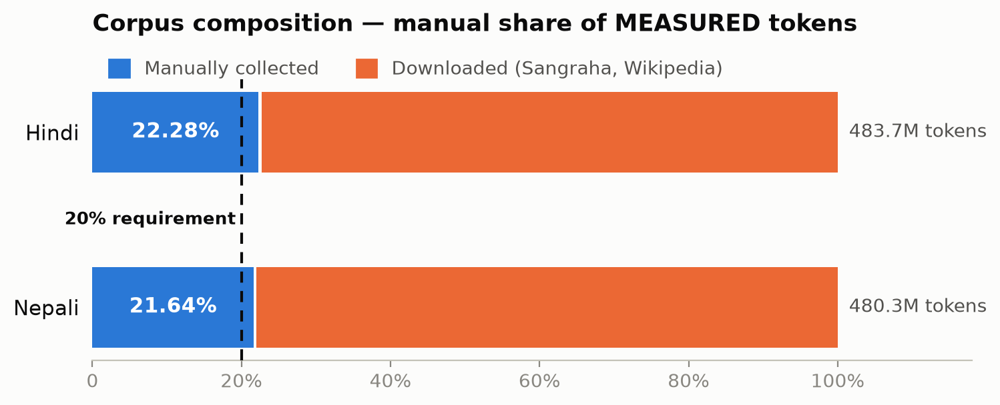
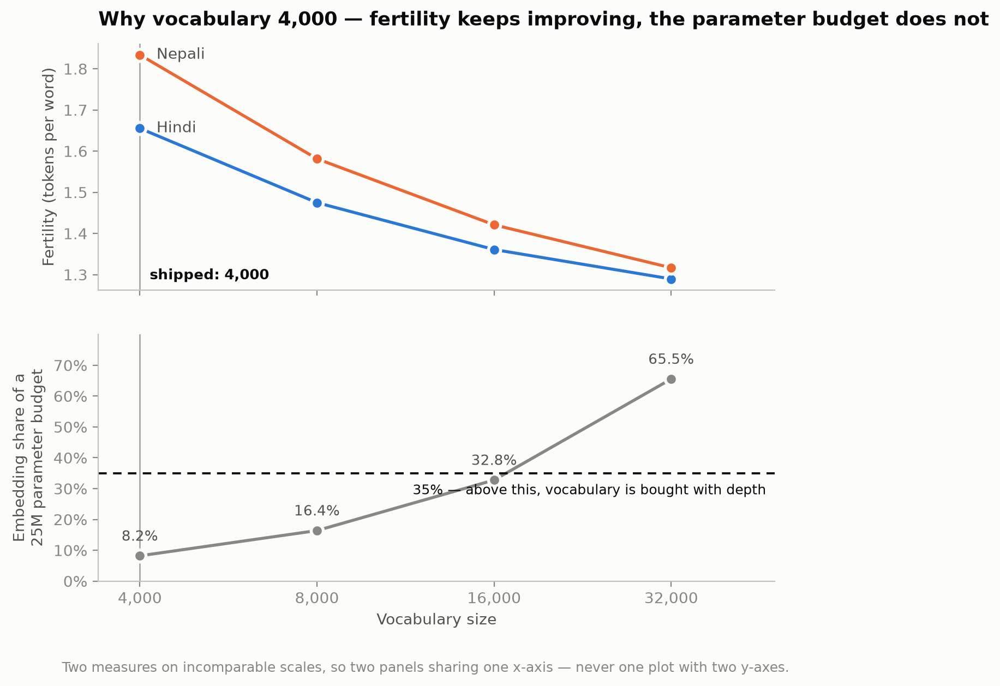

# Phase 1 — Data Collection and Tokenizer Construction

Two fully independent monolingual pipelines: **Hindi** (Model H, higher-resource)
and **Nepali** (Model L, from the allowed lower-resource list). Separate corpora,
separate tokenizers, separate vocabularies. No document, vocabulary or artifact
is shared between them.

## Results

Both corpora are complete and every figure below is **measured** — produced by
encoding the final corpus with the final tokenizer, not by a character-count
proxy.

| | Hindi (Model H) | Nepali (Model L) |
|---|--:|--:|
| **Corpus tokens** | **571,100,312** | **511,379,478** |
| % of ~500M target | 114.2% | 102.3% |
| Training tokens | 559,913,515 | 501,226,336 |
| Manual tokens | 121,590,216 | 106,497,561 |
| **Manual share (requirement ≥ 20%)** | **21.29%** ✅ | **20.83%** ✅ |
| Downloaded tokens | 449,510,096 | 404,881,917 |
| Documents in final corpus | 808,253 | 958,731 |
| Vocabulary size | 4,000 | 4,000 |
| Fertility (tokens/word, held-out test) | 1.6522 | 1.8338 |
| Characters per token | 3.128 | 3.647 |
| UNK rate | 0.0000% | 0.0000% |
| Byte-fallback rate | 0.7316% | 0.2757% |
| Vocabulary utilisation | 95.8% | see `token_stats.json` |
| Zipf slope | −1.1397 | see `token_stats.json` |



> **A token count is meaningless without its tokenizer.** These figures are
> valid only for the vocab-4,000 SentencePiece models in
> `<lang>/tokenizer/vocab/`. The same Nepali corpus measures roughly **345M**
> tokens under a vocab-32,000 model, because characters-per-token rises from
> 3.63 to 5.06. Every reported count names the model that produced it, in
> `<lang>/data/stats/token_accounting.json`.

Full numbers, per-source breakdowns and the audit trail are in
[`report/`](report/) — eight reports generated directly from the statistics
files by `tools/make_reports.py`, so nothing in them is typed by hand.

## Google Drive links

Large artifacts are not committed to git.

| Artifact | Link |
|---|---|
| Final corpus splits — `clean_data_hindi/`, `clean_data_nepali/` | [Drive folder](https://drive.google.com/drive/folders/1pwRASlKuWFjfS1DvV9iks-PZN4Orwfb6) |
| Raw pre-cleaning collection — `raw_data_hindi/`, `raw_data_nepali/` | [Drive folder](https://drive.google.com/drive/folders/1pwRASlKuWFjfS1DvV9iks-PZN4Orwfb6) |
| Tokenizer models, vocabularies and sweep evidence | [Drive folder](https://drive.google.com/drive/folders/1yKSysO5UJdSmYw_H7XrhEY_jx0cfKQIY) |

Each `clean_data_*` folder carries `train/val/test.jsonl.gz` alongside the
`corpus_stats.json` and `token_accounting.json` the counts came from, so the
numbers travel with the data. Tokenizer `.model`/`.vocab` files are small enough
to commit and are also in the repo under `<lang>/tokenizer/vocab/`.

Upload is scripted: `bash tools/upload_to_drive.sh` (add `--with-raw` for the
pre-cleaning data).

---

## Reproduction

```bash
pip install -r requirements.txt

# End to end, one language at a time
python run_phase1.py --lang hindi  --stage all
python run_phase1.py --lang nepali --stage all
```

Stages run individually too, which is what you want when one fails:

```bash
python run_phase1.py --lang hindi --stage discover,scrape
python run_phase1.py --lang hindi --stage build
python run_phase1.py --lang hindi --stage tokenizer --compare-algorithms
python run_phase1.py --lang hindi --stage count,report
```

| Stage | What it does | Output |
|---|---|---|
| `gcs-ingest` | stream Sangraha + Wikipedia from GCS → **downloaded** documents | `<lang>/data/raw/downloaded_*.jsonl` |
| `ingest-existing` | fold local zips/jsonl you already downloaded into the pipeline | `<lang>/data/raw/downloaded_imported.jsonl` |
| `discover` | seed domains → article URLs via sitemaps | `<lang>/data/raw/article_urls.txt` |
| `plan` | can you reach ≥20% manual? run **before** a long collection | printed budget |
| `scrape` | article URLs → **manual** documents | `<lang>/data/raw/manual_scrape.jsonl` |
| `ocr` | PDFs/images → **manual** documents (optional) | `<lang>/data/raw/manual_ocr.jsonl` |
| `pdf-harvest` | fetch PDFs concurrently from `pdf_sources.txt`, robots-respecting | local PDF directory |
| `download` | HuggingFace corpora (only if not already in the bucket) | `<lang>/data/raw/downloaded_*.jsonl` |
| `build` | normalise, filter, dedup, **budget trim**, stratified split | `<lang>/data/splits/*.jsonl` |
| `tokenizer` | train from scratch + vocabulary sweep + statistics | `<lang>/tokenizer/` |
| `count` | authoritative token count + manual fraction | `<lang>/data/stats/token_accounting.json` |
| `report` | the eight Phase 1 reports | `report/*.md` |
| `verify` | cross-corpus and split-integrity checks, exit 0 only if all pass | `report/verification.json` |

Three helpers sit outside the stage list:

```bash
python tools/audit_raw.py --lang hindi --repo-root . --chars-per-token 3.13
```

answers "is there enough collected text to reach the target?" in about a minute,
against a build that takes ninety. It reads the raw files, reads the previous
build's post-dedup character counts, and prints the ceiling the ≥20% rule
imposes. `tools/make_variant.py` sets up an ablation build that shares `raw/`
but keeps its own splits and tokenizer. `tools/upload_to_drive.sh` publishes the
deliverables.

### Corpora already in Cloud Storage — the ≤80%

The downloaded side streams straight out of `gs://lma-01-hi-ne-corpus/raw/`.
Nothing is re-fetched from HuggingFace, and nothing is copied to local disk
first: `gcs-ingest` reads over HTTP and stops the moment the token budget is
met, so the bytes transferred are roughly the bytes kept.

```bash
python -m pipeline.collect.gcs_ingest --lang hindi --dry-run   # inspect first
python run_phase1.py --lang hindi --stage gcs-ingest
```

Sources and budgets live in `<lang>/configs/data_config.yaml`, which is the
single source of truth — CLI flags override it, they do not shadow it. Only
Sangraha (verified and unverified) and Wikipedia are used; `excluded_sources:`
in the same file records what is deliberately left out and why. The bucket also
contains `opus/`, `cc100/`, `oscar/`, `mc4/` and `indiccorp_v2/` directories;
**none of them entered either corpus**, and the provenance report lists them as
excluded rather than as sources.

It labels everything `downloaded`, because that is what it is. Sangraha and
Wikipedia are public corpora — the brief's ≤80%. They do not become manual by
being renamed or moved.

Blobs are read by **windowed byte-range sampling**, not from the top. Hindi's
verified Sangraha is 173 GB and a 400M-token budget touches about 2% of it. The
first 2% of a file built by concatenating sources is whichever source was
written first, not a sample of the corpus — a prefix read would hand the
tokenizer one publisher's vocabulary. Same bytes transferred either way; only
the coverage differs. Verified empirically: a sequential read of a ten-block
fixture drew `{block 0: 1405}`, the strided read drew from all ten.

**See [`docs/GCP_RUNBOOK.md`](docs/GCP_RUNBOOK.md)** for machine sizing, the
`gcloud` commands, expected wall-clock per stage, and the failure modes worth
knowing before a long run.

### The ≥20% manual requirement, as arithmetic

Manual data is **collected, never downloaded** — that is what makes it manual.
`scrape_collect.py` and `ocr_collect.py` produce it; `download_public.py` and
`gcs_ingest.py` produce the other ≤80%.

With M = manual tokens and D = downloaded tokens, the brief requires
`M / (M + D) ≥ 0.20`, which rearranges to **`D ≤ 4M`** — so your
**total corpus is capped at 5× your manual tokens**. There are two ways to
satisfy it, and most people only think of the first:

1. collect more manual data — slow, bounded by how much Devanagari web exists;
2. **download less** — instant, entirely in your control.

Run `python -m pipeline.collect.plan_budget --lang <lang>` before committing to
a long run. A 175M-token corpus that meets the ratio beats a 500M-token one that
fails it, and the brief explicitly permits the shortfall for the lower-resource
language provided you report the exact count and justify it.

**How it actually played out.** The two languages hit different constraints,
and the build reports which one bound:

- **Nepali — `downloaded budget set by: target`.** 398.9M manual characters
  survived cleaning, enough to permit far more downloaded text than the 400M
  target asked for. The size was chosen, not forced.
- **Hindi — `downloaded budget set by: ratio`.** Its URL frontier was exhausted
  (345,585 of 345,597 discovered URLs attempted), leaving 377.0M manual
  characters, and downloaded was capped at 3.878× that to hold the ratio. Hindi
  is limited by its manual yield, not by its token target.

That inverts the expected ordering: Nepali, the lower-resource language, yielded
*more* usable manual text than Hindi. Fewer aggressive `robots.txt`
restrictions on the Nepali publishers we scraped, and a PDF text-layer path that
worked better there.

### Characters per token is not a constant

The budget trim has to convert a token target into a character budget before any
tokenizer exists, so it uses a chars-per-token figure. That figure is not a
property of the language — it is a property of *the documents the budget
admits*. The trim drops least-curated sources first, so raising the budget pulls
in different text and moves the ratio. It is a fixed point, and it takes
iteration:

| Nepali pass | chars/token used | Predicted | Measured |
|---|---|--:|--:|
| 1 | 4.0 proxy | 500.0M | 480.3M |
| 2 | 3.601 / 3.492 | 505.0M | 488.8M |
| 3 | 3.742 / 3.603 | 511.6M | **511.4M** |

`count_corpus_tokens.py` prints the measured value by provenance after every
run, and `build_corpus --from-clean` re-trims from the cleaned pool in seconds
rather than re-running the ninety-minute clean and dedup. Two passes is
normally enough; the first Nepali pass used the 4.0 proxy, which was 10% out.

### Two inputs only you can supply

1. **`<lang>/configs/seed_domains.txt`** — the domains you scrape yourself.
   Throughput is set by the *number of domains*, not by concurrency: each domain
   yields at most ~1.3 pages/s under the 1.5 s politeness delay. 40 domains ≈ 53
   pages/s; 10 domains ≈ 13 pages/s. If you are short of manual tokens, add
   domains. This run used 45 Hindi hosts and 21 Nepali hosts.
2. **PDFs for OCR** (optional) — `pdf-harvest` fills a directory from
   `<lang>/configs/pdf_sources.txt`; `ocr` reads it via `--ocr-input-dir`. Use
   `--text-layer-only` on born-digital PDFs: `pdftotext` returns the exact
   characters in milliseconds where rasterise-then-OCR takes seconds and
   introduces errors.

### Before any real run

Put a real contact address in the User-Agent (`--user-agent`). It is what lets a
publisher email you instead of silently blocking the range.

---

## Layout

```
README.md                     this file — results, reproduction, Drive links
run_phase1.py                 end-to-end orchestrator
requirements.txt
pipeline/                     shared code (artifacts stay per-language)
  manifest.py                 the provenance contract every stage depends on
  collect/
    seed_discovery.py         seed domains -> article URLs  (--merge to extend)
    scrape_collect.py         concurrent, robots-respecting manual scraping
    pdf_harvest.py            concurrent PDF fetch across hosts
    ocr_collect.py            PDF/image OCR -> manual documents
    gcs_ingest.py             GCS corpora -> downloaded documents (budgeted)
    ingest_existing.py        local zips/jsonl -> downloaded documents
    download_public.py        HuggingFace corpora -> downloaded documents
    plan_budget.py            can you reach >=20% manual? arithmetic, not vibes
  process/
    build_corpus.py           normalise, filter, dedup, budget trim, split
    verify_corpora.py         the checks no single-language stage can make
  tokenizer/
    train_tokenizer.py        from-scratch SentencePiece + vocabulary sweep
    tokenizer_report.py       token-frequency stats, chars/token, examples
    count_corpus_tokens.py    token accounting + manual fraction
  quality/
    yi_quality_score.py       LLM quality scoring + distillation (optional)
tools/
  audit_raw.py                is there enough collected text? (minutes, not hours)
  make_reports.py             every report, generated from the stats files
  make_variant.py             ablation build sharing raw/ but nothing else
  upload_to_drive.sh          publish deliverables to Drive
hindi/                        Model H — self-contained
  configs/                    data_config, tokenizer_config, seed_domains, pdf_sources
  data/{raw,interim,splits,stats,quality}
  tokenizer/{vocab,analysis}
nepali/                       Model L — same structure, nothing shared
report/                       the eight Phase 1 reports, figures, verification.json
tests/make_fixture.py         synthetic data to exercise the pipeline offline
```

---

## Phase 1 deliverables

| # | Deliverable | Where |
|---|---|---|
| 1 | Dataset collection scripts (both languages) | `pipeline/collect/` |
| 2 | Dataset preprocessing pipelines | `pipeline/process/build_corpus.py` |
| 3 | Per-language dataset statistics reports | `report/*.md`, `<lang>/data/stats/` |
| 4 | Per-language train/validation/test splits | `<lang>/data/splits/` + Drive |
| 5 | Tokenizer training code (both languages) | `pipeline/tokenizer/train_tokenizer.py` |
| 6 | Vocabulary files (one per language) | `<lang>/tokenizer/vocab/<lang>_tokenizer.vocab` |
| 7 | Tokenizer model files (one per language) | `<lang>/tokenizer/vocab/<lang>_tokenizer.model` |

## Tokenizer and vocabulary choice

SentencePiece **Unigram**, trained from scratch per language, `byte_fallback`
enabled. Byte fallback makes the UNK rate structurally zero — an unseen
character decomposes into UTF-8 byte pieces instead of becoming UNK — so
**byte-fallback rate is the metric that matters**, not UNK rate.

Vocabulary was swept over 4,000 / 8,000 / 16,000 / 32,000 and **4,000 shipped**.
The sweep's own elbow rule chose 32,000, and the override is recorded in
`vocab_selection.json` rather than applied silently. The disagreement is real
and worth stating: the elbow rule optimises fertility alone, and on Devanagari
fertility keeps improving 7–14% per doubling well past the point where the
vocabulary is a sensible use of the parameter budget.

| Vocab | Nepali fertility | Byte-fallback | Embedding params | % of a 25M budget |
|--:|--:|--:|--:|--:|
| **4,000** | **1.8338** | **0.276%** | **2,048,000** | **8.2%** |
| 8,000 | 1.5814 | 0.320% | 4,096,000 | 16.4% |
| 16,000 | 1.4209 | 0.356% | 8,192,000 | 32.8% |
| 32,000 | 1.3166 | 0.384% | 16,384,000 | 65.5% |



At 32,000 the embedding matrix would consume 65.5% of the Phase 2 parameter
budget, leaving 8.6M for the transformer itself. 4,000 sits at **1.21× the
compute-optimal vocabulary** predicted by Tao et al. (2024), *Scaling Laws with
Vocabulary* (`N_v ∝ N_nv^0.83`), which gives 3,311 for 15M non-vocabulary
parameters at `d_model = 512` — and it has the lowest byte-fallback rate of the
four. The full sweep is retained in `sweep_results.csv` so the trade-off stays
inspectable.

**One result that does *not* generalise.** Manual text tokenizes better than
downloaded text in Nepali (fertility 1.8039 vs 1.8501) and worse in Hindi
(1.6682 vs 1.6479), consistently at every swept vocabulary size. With two
languages that is an observation, not a finding, and the reports say so.

## Language selection

- **Model H — Hindi.** The largest public-text footprint of any non-English
  Indian language: multiple national dailies with deep sitemap-exposed archives,
  government publication in Hindi by statute, and substantial coverage in public
  Indic corpora (Sangraha, IndicCorp).
- **Model L — Nepali.** On the permitted list. The Nepali web is roughly an
  order of magnitude smaller than the Hindi web, which is the resource
  constraint this project is meant to expose — though see the ratio discussion
  above for how that expectation was inverted in practice.

## Independence

Enforced structurally, not by convention, and **checked** rather than asserted:

- `pipeline/manifest.py` refuses any document whose `language` is not one of the
  two, and every collector writes into `<lang>/data/` only.
- `doc_id` is a content hash, so cross-language collisions are detectable.
- The tokenizer trains on `<lang>/data/splits/train.jsonl` alone; vocabularies
  are never merged.
- `pipeline/process/verify_corpora.py` spans both languages and runs seven
  checks — no shared documents, provenance on every document, no exact
  duplicates within a corpus, disjoint splits, manual fraction in tokens, valid
  UTF-8, no empty documents. It exits non-zero if any fails, and its output is
  committed as `report/verification.json`.

The last point exists because the original collision detector was *defined and
never called*. A constraint nothing checks is a comment.

## Deduplication

Exact duplicates by content hash; near-duplicates by **MinHash with banded
LSH** — 96 permutations, Jaccard threshold 0.8, which resolves to 9 bands of 10
rows (approximate threshold 0.8027) via `P(candidate) = 1 − (1 − s^r)^b`. When
two documents collide the survivor is chosen by source priority: manual
outranks all downloaded sources, then Wikipedia, verified Sangraha, unverified
Sangraha in that order.

The hashing half is pure and runs in worker processes; only the claim step is
sequential. Parallel and serial builds were verified byte-identical on the same
input.

## Testing offline

```bash
python tests/make_fixture.py .
python -m pipeline.process.build_corpus --lang hindi --repo-root .
python run_phase1.py --lang hindi --stage tokenizer,count,report --vocab-sizes 256 384 512
```

The fixture is deliberately small, so it only supports a few hundred vocabulary
pieces. It exists to prove the wiring, not to produce a usable tokenizer.
