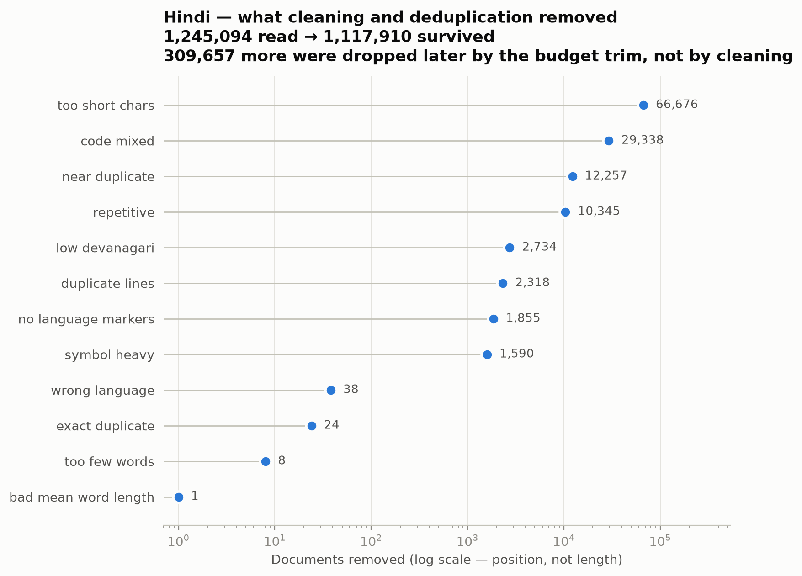

# Phase 1 — Data Cleaning Report

| | |
|---|---|
| Generated (UTC) | 2026-08-25 09:38:50 |
| Git commit | `987ad30458abfbc6b83154a7717d846e4bc85abc` |
| Branch | `phase-1` |
| Working tree | **dirty** — uncommitted changes present |

> Values marked **ESTIMATE** are character-based proxies computed before a tokenizer existed. Final token counts are measured by encoding the final corpus with the final tokenizer (`count_corpus_tokens.py`).

## Methodology

Seven ordered stages in `pipeline/process/build_corpus.py`:

1. **Normalise** — NFC, nukta recomposition, zero-width strip, whitespace collapse, danda spacing
2. **Validate** — length, Devanagari ratio, Latin ratio, Hindi-vs-Nepali marker discrimination
3. **Quality** — Gopher-style repetition, mean word length, symbol ratio, duplicate-line ratio
4. **Exact dedup** — BLAKE2b over the aggressively normalised form (case-folded, punctuation and danda stripped)
5. **Near dedup** — MinHash over word 5-grams with banded LSH, global across every source and both provenance classes
6. **Budget trim** — to the manual/downloaded token targets
7. **Split** — train/val/test stratified by `(provenance_class, source)`

### Why dedup runs before the split, and why it is global

If a document appears in both Sangraha and the manual scrape and dedup ran after splitting, the two copies could land in train and test. Phase 2 perplexity would then measure memorisation rather than language modelling, and that is not recoverable after the fact. Sangraha is itself built from crawls of the same publishers the scraper visits, so this overlap is expected rather than hypothetical.

### Deduplication tie-break

`iter_language_docs` yields manual files first. Deduplication keeps whichever copy it sees first, so when the same article arrives from both sides the **manual** copy survives and the downloaded duplicate is discarded — same corpus, same document count, but the provenance credit lands on the manually collected side.

## Hindi

_Hindi — documents removed, by filter_

### Before / after

| Stage | Documents | Retention |
|---|--:|--:|
| Raw collected | 1,245,094 | — |
| After cleaning + dedup | 1,117,910 | 89.8% |
| In final corpus (after budget trim) | 808,253 | 64.9% |

### Removed, and why

| Reason | Documents |
|---|--:|
| over budget | 309,657 |
| too short chars | 66,676 |
| code mixed | 29,338 |
| near duplicate | 12,257 |
| repetitive | 10,345 |
| low devanagari | 2,734 |
| duplicate lines | 2,318 |
| no language markers | 1,855 |
| symbol heavy | 1,590 |
| wrong language | 38 |
| exact duplicate | 24 |
| too few words | 8 |
| bad mean word length | 1 |

Boilerplate lines removed in place: **58,551**

### Characters by split and provenance

| Split | Documents | Manual chars | Downloaded chars |
|---|--:|--:|--:|
| train | 792,123 | 369,664,048 | 1,380,221,920 |
| val | 8,065 | 3,673,302 | 13,952,245 |
| test | 8,065 | 3,695,665 | 13,665,014 |

### Budget trim

- Targeted **20.5%** manual (requirement 20% + 0.5% margin for character/token drift)
- Manual kept: 377,033,015 of 377,033,015 chars available
- Downloaded kept: 1,407,839,179 of 2,065,263,422 chars available
- Binding constraint: **ratio**

MinHash Jaccard threshold: **0.8**, word 5-grams.

## Nepali

_Nepali — documents removed, by filter_

⚠ **NOT YET MEASURED** — run `python tools/make_figures.py --repo-root .`

### Before / after

| Stage | Documents | Retention |
|---|--:|--:|
| Raw collected | 0 | — |
| After cleaning + dedup | 75,479 | 7547900.0% |
| In final corpus (after budget trim) | 75,479 | 7547900.0% |

### Removed, and why

| Reason | Documents |
|---|--:|

Boilerplate lines removed in place: **⚠ **NOT YET MEASURED****

### Characters by split and provenance

| Split | Documents | Manual chars | Downloaded chars |
|---|--:|--:|--:|
| train | 73,969 | 129,656,440 | 0 |
| val | 755 | 1,291,837 | 0 |
| test | 755 | 1,286,429 | 0 |

### Budget trim

- Targeted **20.5%** manual (requirement 20% + 0.5% margin for character/token drift)
- Manual kept: 132,234,706 of 132,234,706 chars available
- Downloaded kept: 0 of 0 chars available
- Binding constraint: **ratio**

MinHash Jaccard threshold: **0.8**, word 5-grams.
