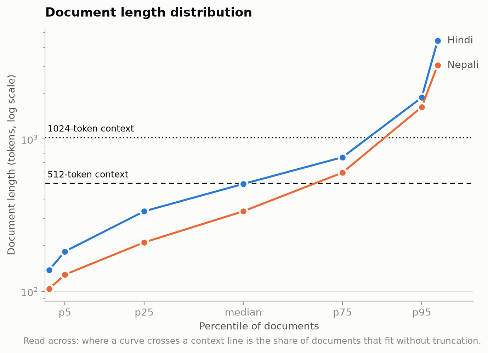

# Phase 1 — Final Corpus Statistics

| | |
|---|---|
| Generated (UTC) | 2026-09-13 12:24:37 |
| Git commit | `c2a82c02fa66e6395fd229e237a102fc4cb385f5` |
| Branch | `phase-1-fix` |
| Working tree | **dirty** — uncommitted changes present |

> Values marked **ESTIMATE** are character-based proxies computed before a tokenizer existed. Final token counts are measured by encoding the final corpus with the final tokenizer (`count_corpus_tokens.py`).

## Requirement compliance

| Requirement | Target | Hindi (measured) | Nepali (measured) | Status |
|---|---|--:|--:|:-:|
| Corpus size | ~500M tokens each | 483,658,831 | 480,275,183 | ❌ |
| Manual share of tokens | ≥ 20% | 22.28% | 21.64% | ✅ |
| Downloaded tokens | ~400M each | 375,880,594 | 376,358,335 | ✅ |
| Tokenizer trained from scratch | no pretrained models | SentencePiece Unigram, vocab 4,000 | SentencePiece Unigram, vocab 4,000 | ✅ |
| Every document has provenance | 0 unlabelled | 0 | 0 | ✅ |
| Corpora independent, splits disjoint | verify_corpora all pass | all checks pass | all checks pass | ✅ |

_Manual share of measured tokens, against the 20% requirement_

## Dataset statistics

Produced by `python -m pipeline.stats.dataset_stats --lang <lang> --repo-root .`, measured over every document in the final splits.

_Document length by percentile, against typical context windows_

### Size and shape

| | Hindi | Nepali |
|---|--:|--:|
| Documents | 677,588 | 900,737 |
| Characters | 1,509,056,248 | 1,744,959,816 |
| Words (whitespace) | 291,431,510 | 260,872,195 |
| Tokens | 483,658,831 | 480,275,183 |
| Sentences | 16,768,233 | 18,424,895 |
| Distinct sources | 39 | 192 |
| Manual domains | 37 | 16 |

### Characters per document

| Language | mean | std | p5 | p25 | median | p75 | p95 | p99 | max |
|---|--:|--:|--:|--:|--:|--:|--:|--:|--:|
| Hindi | 2,227 | 2,587 | 567 | 1,078 | 1,625 | 2,400 | 5,772 | 13,280 | 145,303 |
| Nepali | 1,937 | 2,191 | 500 | 800 | 1,259 | 2,222 | 5,727 | 10,432 | 152,055 |

### Words per document

| Language | mean | std | p5 | p25 | median | p75 | p95 | p99 | max |
|---|--:|--:|--:|--:|--:|--:|--:|--:|--:|
| Hindi | 430 | 492 | 108 | 209 | 317 | 466 | 1,109 | 2,543 | 24,209 |
| Nepali | 290 | 330 | 74 | 119 | 187 | 330 | 864 | 1,577 | 23,160 |

### Tokens per document

| Language | mean | std | p5 | p25 | median | p75 | p95 | p99 | max |
|---|--:|--:|--:|--:|--:|--:|--:|--:|--:|
| Hindi | 714 | 884 | 183 | 336 | 508 | 760 | 1,874 | 4,421 | 74,900 |
| Nepali | 533 | 647 | 129 | 210 | 336 | 602 | 1,625 | 3,047 | 48,282 |

A median far below the mean is the normal shape for web text: a long right tail of very long documents pulls the mean up. The percentile columns are what tell you how much of the corpus survives a fixed context window in Phase 2 — read the p-column nearest your context length.

### Hindi — composition by source

| Source | Provenance | Documents | Characters | Share of chars |
|---|---|--:|--:|--:|
| `sangraha_verified` | downloaded | 470,127 | 996,064,749 | 66.01% |
| `wikipedia` | downloaded | 67,613 | 178,769,355 | 11.85% |
| `hindi.moneycontrol.com` | manual | 22,680 | 58,595,743 | 3.88% |
| `www.patrika.com` | manual | 22,857 | 52,583,476 | 3.48% |
| `www.amarujala.com` | manual | 19,958 | 47,660,044 | 3.16% |
| `www.hindisamay.com` | manual | 5,855 | 43,525,983 | 2.88% |
| `www.livehindustan.com` | manual | 22,520 | 38,657,498 | 2.56% |
| `www.bhaskar.com` | manual | 19,824 | 26,859,126 | 1.78% |
| `hindi.downtoearth.org.in` | manual | 1,959 | 10,891,719 | 0.72% |
| `www.hindwi.org` | manual | 2,749 | 8,455,465 | 0.56% |
| `hindi.webdunia.com` | manual | 2,535 | 6,936,969 | 0.46% |
| `www.jagran.com` | manual | 2,437 | 5,937,678 | 0.39% |
| `www.prabhatkhabar.com` | manual | 2,116 | 5,842,947 | 0.39% |
| `www.dainiktribuneonline.com` | manual | 1,743 | 4,470,236 | 0.30% |
| `navbharattimes.indiatimes.com` | manual | 1,232 | 3,266,755 | 0.22% |
| `www.punjabkesari.in` | manual | 1,434 | 3,057,632 | 0.20% |
| `www.tv9hindi.com` | manual | 2,067 | 2,833,188 | 0.19% |
| `www.inextlive.com` | manual | 978 | 2,272,379 | 0.15% |
| `www.haribhoomi.com` | manual | 898 | 2,176,756 | 0.14% |
| `www.bbc.com` | manual | 639 | 1,380,078 | 0.09% |
| `www.abplive.com` | manual | 431 | 1,196,217 | 0.08% |
| `bhaskar.com` | manual | 1,566 | 1,142,918 | 0.08% |
| `nari.punjabkesari.in` | manual | 397 | 837,328 | 0.06% |
| `haryana.punjabkesari.in` | manual | 404 | 834,111 | 0.06% |
| `mp.punjabkesari.in` | manual | 398 | 790,210 | 0.05% |
| `up.punjabkesari.in` | manual | 351 | 725,045 | 0.05% |
| `himachal.punjabkesari.in` | manual | 399 | 714,560 | 0.05% |
| `sports.punjabkesari.in` | manual | 378 | 693,510 | 0.05% |
| `bihar.punjabkesari.in` | manual | 358 | 624,137 | 0.04% |
| `punjab.punjabkesari.in` | manual | 379 | 614,912 | 0.04% |
| `www.naidunia.com` | manual | 269 | 490,132 | 0.03% |
| `www.newsonair.gov.in` | manual | 4 | 49,752 | 0.00% |
| `www.bbc.co.uk` | manual | 13 | 41,902 | 0.00% |
| `rajasthan.punjabkesari.in` | manual | 6 | 25,764 | 0.00% |
| `jammukashmir.punjabkesari.in` | manual | 8 | 17,144 | 0.00% |
| `uttarakhand.punjabkesari.in` | manual | 3 | 11,568 | 0.00% |
| `chandigarh.punjabkesari.in` | manual | 1 | 5,756 | 0.00% |
| `gadget.punjabkesari.in` | manual | 1 | 2,032 | 0.00% |
| `bollywood.punjabkesari.in` | manual | 1 | 1,474 | 0.00% |

**Manually collected text came from 37 domains.** Top 10 by characters:

| Host | Documents | Characters | Share of manual chars |
|---|--:|--:|--:|
| `hindi.moneycontrol.com` | 22,680 | 58,595,743 | 17.53% |
| `www.patrika.com` | 22,857 | 52,583,476 | 15.73% |
| `www.amarujala.com` | 19,958 | 47,660,044 | 14.26% |
| `www.hindisamay.com` | 5,855 | 43,525,983 | 13.02% |
| `www.livehindustan.com` | 22,520 | 38,657,498 | 11.57% |
| `www.bhaskar.com` | 19,824 | 26,859,126 | 8.04% |
| `hindi.downtoearth.org.in` | 1,959 | 10,891,719 | 3.26% |
| `www.hindwi.org` | 2,749 | 8,455,465 | 2.53% |
| `hindi.webdunia.com` | 2,535 | 6,936,969 | 2.08% |
| `www.jagran.com` | 2,437 | 5,937,678 | 1.78% |

The three largest hosts account for 47.5% of the manual characters. Concentration matters: a corpus scraped from many domains but dominated by a few is, in effect, a corpus of those few.

### Nepali — composition by source

| Source | Provenance | Documents | Characters | Share of chars |
|---|---|--:|--:|--:|
| `sangraha_verified` | downloaded | 668,195 | 1,327,095,642 | 76.05% |
| `www.karobardaily.com` | manual | 20,281 | 53,747,663 | 3.08% |
| `rajdhanidaily.com` | manual | 19,111 | 43,144,073 | 2.47% |
| `clickmandu.com` | manual | 19,351 | 37,484,040 | 2.15% |
| `www.nepalpress.com` | manual | 19,756 | 33,448,540 | 1.92% |
| `www.dcnepal.com` | manual | 19,110 | 31,454,381 | 1.80% |
| `bizmandu.com` | manual | 17,357 | 31,290,182 | 1.79% |
| `kendrabindu.com` | manual | 19,118 | 31,212,905 | 1.79% |
| `khabarhub.com` | manual | 18,922 | 30,705,330 | 1.76% |
| `deshsanchar.com` | manual | 18,647 | 29,773,280 | 1.71% |
| `wikipedia` | downloaded | 11,248 | 28,904,271 | 1.66% |
| `www.reportersnepal.com` | manual | 12,827 | 22,164,432 | 1.27% |
| `arthasarokar.com` | manual | 17,387 | 20,568,425 | 1.18% |
| `www.imagekhabar.com` | manual | 15,587 | 17,874,466 | 1.02% |
| `ocr:1715252289_10__40cb5888` | manual | 691 | 923,536 | 0.05% |
| `hamrakura.com` | manual | 371 | 886,936 | 0.05% |
| `www.bbc.com` | manual | 220 | 435,610 | 0.02% |
| `ocr:1715252208_86__f4f6ca23` | manual | 222 | 316,835 | 0.02% |
| `ocr:Final__EDIT__145_x_210___2083-03-21_pcirbjq__1517b6e8` | manual | 133 | 188,856 | 0.01% |
| `ocr:__mqsvmdf__415af963` | manual | 109 | 159,171 | 0.01% |
| `ocr:1715248103_92__d80b56bd` | manual | 165 | 154,095 | 0.01% |
| `ocr:1715252125_25__6a88e193` | manual | 109 | 154,010 | 0.01% |
| `ocr:___unicode__mtbuyjt__3d20d886` | manual | 89 | 132,823 | 0.01% |
| `ocr:__ovhjhlm__e4f6b86a` | manual | 55 | 118,974 | 0.01% |
| `ocr:__tgydlry__dc2aca01` | manual | 83 | 114,678 | 0.01% |
| `ocr:1720761923_39__417a3e0d` | manual | 58 | 102,051 | 0.01% |
| `ocr:Report_hprat6w__2e071468` | manual | 83 | 91,544 | 0.01% |
| `ocr:1720761782_41__214eb7c1` | manual | 52 | 88,327 | 0.01% |
| `ocr:_1_-_4-3_f7jjk4d__33afe2d7` | manual | 64 | 87,045 | 0.00% |
| `ocr:1715251918_12__21513440` | manual | 57 | 76,389 | 0.00% |
| `ocr:_-__rptvcvj__8f921b83` | manual | 42 | 73,660 | 0.00% |
| `ocr:_4__nomy0tn__99061545` | manual | 50 | 73,579 | 0.00% |
| `ocr:__oijygwa__e0476cc7` | manual | 27 | 72,299 | 0.00% |
| `ocr:1720762269_65__13d74680` | manual | 44 | 67,633 | 0.00% |
| `ocr:__yqmb7yz_tyqadjd__2535c8d5` | manual | 38 | 63,143 | 0.00% |
| `ocr:__it7vg66__9827f903` | manual | 33 | 56,446 | 0.00% |
| `ocr:final_annual_report_2081_acgbgbr_neckv8b__0ca53e86` | manual | 40 | 53,868 | 0.00% |
| `ocr:1714977589_71__2d56c6d7` | manual | 36 | 49,899 | 0.00% |
| `ocr:__5xnvu6w__4ca194d4` | manual | 33 | 49,505 | 0.00% |
| `ocr:_._._-__o1kpiso__db112695` | manual | 31 | 43,590 | 0.00% |
| `ocr:_PDF__s8gdu5v__6016e83a` | manual | 21 | 39,344 | 0.00% |
| `ocr:__xm4sbx2__7dabde39` | manual | 22 | 37,266 | 0.00% |
| `ocr:_-__qm4torj__df84439d` | manual | 15 | 33,789 | 0.00% |
| `ocr:__sojst2i__a7c1d75e` | manual | 20 | 33,766 | 0.00% |
| `ocr:1720761129_98__c6889f1e` | manual | 26 | 33,257 | 0.00% |
| `ocr:1719823289_72__37486dbc` | manual | 21 | 31,570 | 0.00% |
| `ocr:1720761248_24__330fd58a` | manual | 21 | 31,359 | 0.00% |
| `ocr:AI-new_ce2eme0_qhxoali__31fdd3ff` | manual | 17 | 29,782 | 0.00% |
| `ocr:1719908457_19__c4458ee1` | manual | 18 | 29,520 | 0.00% |
| `ocr:1_x65nexc__c4a28b95` | manual | 19 | 29,515 | 0.00% |
| `ocr:_-__4xkxjko__483c621a` | manual | 24 | 29,233 | 0.00% |
| `ocr:__qmmvnzq__ddcd0fdb` | manual | 10 | 28,484 | 0.00% |
| `ocr:__q2zawfm__45001906` | manual | 11 | 26,093 | 0.00% |
| `ocr:1720760996_82__06dab5b9` | manual | 15 | 25,608 | 0.00% |
| `ocr:shrawan_CABINET_2082_6gns1up__e0abf968` | manual | 9 | 24,939 | 0.00% |
| `ocr:1719820457_1__d90cf1c2` | manual | 16 | 24,768 | 0.00% |
| `ocr:BAISAKH_CABINET_2083_tionbkx__abaa6723` | manual | 10 | 23,721 | 0.00% |
| `ocr:_2081-12-4_qgvn9q6__e2bf2ee1` | manual | 15 | 23,545 | 0.00% |
| `lawcommission.gov.np` | manual | 4 | 22,975 | 0.00% |
| `ocr:__y8j1fh1__99b78f0a` | manual | 16 | 22,119 | 0.00% |
| `ocr:_-__kwlomq2__1e2cc83f` | manual | 13 | 20,196 | 0.00% |
| `ocr:_-__s511as7__99d24bb9` | manual | 12 | 19,504 | 0.00% |
| `ocr:1720760892_80__f32458aa` | manual | 14 | 17,823 | 0.00% |
| `ocr:_-_-_-_-__myyaris__a9582739` | manual | 6 | 17,815 | 0.00% |
| `ocr:__kuuvvrg__1cf7abc8` | manual | 9 | 16,884 | 0.00% |
| `ocr:_-__anfoi7o__6e0e93bd` | manual | 8 | 16,578 | 0.00% |
| `ocr:CABINET_2082_chaitra_veoiplv__787e37e7` | manual | 5 | 15,738 | 0.00% |
| `ocr:1714979111_63__0f9ccb38` | manual | 13 | 15,447 | 0.00% |
| `ocr:__2vei9k2__9cf0607d` | manual | 7 | 15,428 | 0.00% |
| `ocr:___________4f4157f9` | manual | 12 | 15,370 | 0.00% |
| `ocr:_2080-02-32_A5_Size_pyxyao4__b8de9ec3` | manual | 9 | 14,867 | 0.00% |
| `ocr:__fagqysm__07b1a402` | manual | 5 | 14,842 | 0.00% |
| `www.opmcm.gov.np` | manual | 5 | 14,168 | 0.00% |
| `ocr:__kpud6xl__7640314e` | manual | 12 | 13,424 | 0.00% |
| `ocr:BHADRA_CABINET_2082_uk0h2ym__9474ed79` | manual | 5 | 13,127 | 0.00% |
| `ocr:__6ihxhtm__04cd8f1f` | manual | 8 | 12,245 | 0.00% |
| `ocr:1720764070_72__5a8bcea4` | manual | 8 | 11,954 | 0.00% |
| `ocr:__kvsnh9e__a8b75f57` | manual | 7 | 11,691 | 0.00% |
| `ocr:_-_-__yeerrm0__85a02af3` | manual | 7 | 11,138 | 0.00% |
| `ocr:___8__divop8n__7384ddb1` | manual | 8 | 11,107 | 0.00% |
| `ocr:CABINET-2082-BAISAKH_d1mmxdv__9701c42d` | manual | 4 | 11,004 | 0.00% |
| `ocr:1720339028_48__d38afe22` | manual | 7 | 10,976 | 0.00% |
| `ocr:1719914613_79__d85b5f7f` | manual | 8 | 10,943 | 0.00% |
| `ocr:1715247709_25__87fecb51` | manual | 6 | 10,848 | 0.00% |
| `ocr:_-__u0jr8pp__4ea44002` | manual | 7 | 10,840 | 0.00% |
| `ocr:1719914706_83__646fb09c` | manual | 8 | 10,803 | 0.00% |
| `ocr:1719822704_14__42139aee` | manual | 8 | 10,696 | 0.00% |
| `ocr:__maglrxc__63e1a811` | manual | 7 | 10,386 | 0.00% |
| `ocr:__qhsirsf__4410351e` | manual | 7 | 10,338 | 0.00% |
| `ocr:1719824227_70__75762c04` | manual | 7 | 10,303 | 0.00% |
| `ocr:Cabinet-decision-Poush-2081_fz20yg9__c0e42a63` | manual | 4 | 10,250 | 0.00% |
| `ocr:1719914359_61__924311d9` | manual | 8 | 10,075 | 0.00% |
| `ocr:__9nuk3f6__ded4d113` | manual | 7 | 10,035 | 0.00% |
| `ocr:1719822612_17__8a8a92b2` | manual | 8 | 9,924 | 0.00% |
| `ocr:__pmwjaug__1dc01df4` | manual | 6 | 9,919 | 0.00% |
| `ocr:1719996824_96__db8674a9` | manual | 8 | 9,889 | 0.00% |
| `ocr:1719820999_24__61292d02` | manual | 8 | 9,507 | 0.00% |
| `ocr:CABINET_2083_JESTHA_8lko6du__caae90d5` | manual | 3 | 9,263 | 0.00% |
| `ocr:CABINET_2082_ASOJ_7uide2h__2bec58ad` | manual | 3 | 9,093 | 0.00% |
| `ocr:__tgt2pkp__d8faf687` | manual | 6 | 9,069 | 0.00% |
| `ocr:1719909146_71__1a754b78` | manual | 5 | 8,769 | 0.00% |
| `ocr:1715242928_46__9b6d7b91` | manual | 6 | 8,696 | 0.00% |
| `ocr:_2081.11.25_kanoon_bata_prapta_7pkrl9n__6ecb37e0` | manual | 8 | 8,625 | 0.00% |
| `ocr:_______bb7ed037` | manual | 6 | 8,539 | 0.00% |
| `ocr:_-__ygieuab__80f6948c` | manual | 5 | 8,524 | 0.00% |
| `ocr:1719822822_68__7d87e429` | manual | 6 | 7,978 | 0.00% |
| `ocr:1719917433_11__7a42ccb3` | manual | 5 | 7,483 | 0.00% |
| `ocr:Final_Opmc_-_8-11_2w5ukgo__de9fdf4c` | manual | 5 | 7,444 | 0.00% |
| `ocr:_1__h8j06ca__56e4240c` | manual | 5 | 7,409 | 0.00% |
| `ocr:1719916979_51__b4165a03` | manual | 5 | 7,203 | 0.00% |
| `ocr:__gpekbmh__53267fe8` | manual | 5 | 6,913 | 0.00% |
| `ocr:__hpbkmvv__ea84af51` | manual | 6 | 6,768 | 0.00% |
| `ocr:1715064962_77__0f5c784e` | manual | 4 | 6,719 | 0.00% |
| `ocr:__6s0pvxv__ec161756` | manual | 5 | 6,591 | 0.00% |
| `ocr:_-_-_-_-_-__ag2yndc__69f6bfdd` | manual | 5 | 6,540 | 0.00% |
| `ocr:__flo6um9__842a02a7` | manual | 4 | 6,386 | 0.00% |
| `ocr:_-_-_-_._.-__iyawath__145b5ac9` | manual | 2 | 6,354 | 0.00% |
| `ocr:Cabinet-CHAITRA-2081_oldfjpa__c5ab3724` | manual | 2 | 6,239 | 0.00% |
| `ocr:____zse7v7b__fa35a007` | manual | 4 | 6,189 | 0.00% |
| `ocr:__o1yj1u1__93744d9e` | manual | 4 | 6,076 | 0.00% |
| `ocr:CABINET_2082_Magh_97ulkfm__55ad97da` | manual | 2 | 5,816 | 0.00% |
| `ocr:CABINET_2082_Fagun_gzq0efw__ee2c3c2c` | manual | 2 | 5,788 | 0.00% |
| `ocr:1719919154_69__c834730f` | manual | 4 | 5,711 | 0.00% |
| `ocr:1719919055_30__57c7ecc1` | manual | 4 | 5,699 | 0.00% |
| `ocr:1719912647_68__c97c49ad` | manual | 4 | 5,666 | 0.00% |
| `ocr:1719918414_14__23c4230b` | manual | 4 | 5,557 | 0.00% |
| `ocr:1719912728_98__38d21145` | manual | 5 | 5,413 | 0.00% |
| `ocr:1719913779_66__719c395e` | manual | 5 | 5,358 | 0.00% |
| `ocr:__wqtzxch__9e6322b4` | manual | 4 | 5,329 | 0.00% |
| `ocr:1720762061_5__6a7faffc` | manual | 3 | 5,310 | 0.00% |
| `ocr:__twvbuqg__aec332cb` | manual | 4 | 5,259 | 0.00% |
| `ocr:__qwbsjqt__a8901a73` | manual | 4 | 5,255 | 0.00% |
| `ocr:__3qj4j0d__cde76f55` | manual | 6 | 5,197 | 0.00% |
| `ocr:1719918613_2__d5386b70` | manual | 4 | 5,133 | 0.00% |
| `ocr:1719826307_12__cc5fa7cf` | manual | 3 | 5,067 | 0.00% |
| `ocr:_-__jo1ga5t__796c3de6` | manual | 6 | 4,983 | 0.00% |
| `ocr:1719825782_5__72a271ac` | manual | 4 | 4,948 | 0.00% |
| `ocr:1720348813_90__3578b8a0` | manual | 5 | 4,842 | 0.00% |
| `ocr:1719919243_28__1674ac8a` | manual | 3 | 4,459 | 0.00% |
| `ocr:__apkt4cj__5861a402` | manual | 3 | 4,303 | 0.00% |
| `ocr:1719917306_61__61b3db89` | manual | 3 | 4,229 | 0.00% |
| `ocr:1719821914_46__43c10c58` | manual | 3 | 4,126 | 0.00% |
| `ocr:____6rexgsn__825d54b5` | manual | 3 | 3,948 | 0.00% |
| `ocr:1720764574_84__79eb2b4d` | manual | 3 | 3,788 | 0.00% |
| `ocr:__ridtm22__1b47d2d8` | manual | 2 | 3,599 | 0.00% |
| `ocr:1719823600_7__a5994fbe` | manual | 3 | 3,573 | 0.00% |
| `ocr:_-__0ivkxnh__1d173e05` | manual | 4 | 3,548 | 0.00% |
| `ocr:__uy6iozg__f04499e4` | manual | 2 | 3,532 | 0.00% |
| `ocr:_Final_m9sa1dx__2969d516` | manual | 2 | 3,517 | 0.00% |
| `ocr:__cwgteql__5efd973e` | manual | 3 | 3,494 | 0.00% |
| `ocr:JESTHA-CABINET-2082_lowfrdc__9ce53a82` | manual | 1 | 3,481 | 0.00% |
| `ocr:__ibwryjd__0ebcd830` | manual | 5 | 3,441 | 0.00% |
| `ocr:__nju58og__1d6e5296` | manual | 2 | 3,428 | 0.00% |
| `ocr:1719820777_84__0d398b15` | manual | 3 | 3,398 | 0.00% |
| `ocr:1720082630_5__d48d4acb` | manual | 4 | 3,375 | 0.00% |
| `ocr:1719823027_88__5f4076b5` | manual | 3 | 3,323 | 0.00% |
| `ocr:__fdsasfz__7801f018` | manual | 3 | 3,316 | 0.00% |
| `ocr:1720344306_97__df4d0b15` | manual | 4 | 3,221 | 0.00% |
| `ocr:CABINET_2082_POUSH_u0hjuue__b3f350fa` | manual | 1 | 3,105 | 0.00% |
| `ocr:Cabinet-MAGH-2081_oysiura__fe2a00eb` | manual | 1 | 3,032 | 0.00% |
| `ocr:_cabinet_bata_aayako__jlknzl2__ea5c5c96` | manual | 2 | 2,993 | 0.00% |
| `ocr:CABINET_2082_KARTIK_kvl6cyv__21a299c0` | manual | 1 | 2,842 | 0.00% |
| `ocr:_a5_Final_t3xdgyt__56c034ae` | manual | 2 | 2,767 | 0.00% |
| `ocr:1719823756_80__48a2bf5f` | manual | 2 | 2,743 | 0.00% |
| `ocr:__alcy3tj__534e2169` | manual | 2 | 2,715 | 0.00% |
| `ocr:__ld6ybbj__69c7f566` | manual | 2 | 2,485 | 0.00% |
| `ocr:_2073_vtphor5__4c843e2d` | manual | 1 | 2,389 | 0.00% |
| `ocr:1720159241_3__4273228b` | manual | 2 | 2,214 | 0.00% |
| `ocr:1720088365_31__07252f78` | manual | 2 | 2,012 | 0.00% |
| `ocr:_-__kxto59m__e60fad8f` | manual | 1 | 1,962 | 0.00% |
| `ocr:1720520065_5__87ba1a0d` | manual | 3 | 1,845 | 0.00% |
| `ocr:______51c2bvn__4a158bab` | manual | 1 | 1,813 | 0.00% |
| `ocr:__jovtmsp__0b56e029` | manual | 1 | 1,628 | 0.00% |
| `ocr:1719908256_11__37166913` | manual | 1 | 1,603 | 0.00% |
| `ocr:1715247854_87__8f77bde3` | manual | 1 | 1,575 | 0.00% |
| `ocr:18.__jcswmyx__f658f57f` | manual | 1 | 1,568 | 0.00% |
| `ocr:1719818188_42__26334a9e` | manual | 1 | 1,490 | 0.00% |
| `ocr:_2082_b7fvuiz__88c7c567` | manual | 1 | 1,375 | 0.00% |
| `ocr:____7qzgyas__c2f7e19d` | manual | 1 | 1,371 | 0.00% |
| `ocr:1719909318_65__b812a210` | manual | 1 | 1,362 | 0.00% |
| `ocr:_208__yoek1bi__6b520d46` | manual | 1 | 1,358 | 0.00% |
| `ocr:1719908386_53__35834f0c` | manual | 1 | 1,321 | 0.00% |
| `ocr:__hk0msuh__64c4307d` | manual | 1 | 1,273 | 0.00% |
| `ocr:__bzpydam__6164f543` | manual | 1 | 1,246 | 0.00% |
| `ocr:__cxk5kez__3d67e917` | manual | 1 | 1,207 | 0.00% |
| `ocr:1719907370_53__c2be6d5e` | manual | 1 | 1,042 | 0.00% |
| `ocr:1719918776_29__91cb0ff0` | manual | 1 | 980 | 0.00% |
| `ocr:__._.__83v8bgr__2769450a` | manual | 1 | 861 | 0.00% |
| `ocr:_-__3kqa7mz__ea3be71f` | manual | 1 | 801 | 0.00% |
| `ocr:_1__rsyc06n__2215ab42` | manual | 1 | 784 | 0.00% |
| `ocr:1719918524_95__51db3e69` | manual | 1 | 444 | 0.00% |
| `ocr:1719918861_15__6fe2c761` | manual | 1 | 443 | 0.00% |

**Manually collected text came from 16 domains.** Top 10 by characters:

| Host | Documents | Characters | Share of manual chars |
|---|--:|--:|--:|
| `www.karobardaily.com` | 20,281 | 53,747,663 | 13.82% |
| `rajdhanidaily.com` | 19,111 | 43,144,073 | 11.09% |
| `clickmandu.com` | 19,351 | 37,484,040 | 9.64% |
| `www.nepalpress.com` | 19,756 | 33,448,540 | 8.60% |
| `www.dcnepal.com` | 19,110 | 31,454,381 | 8.09% |
| `bizmandu.com` | 17,357 | 31,290,182 | 8.04% |
| `kendrabindu.com` | 19,118 | 31,212,905 | 8.02% |
| `khabarhub.com` | 18,922 | 30,705,330 | 7.89% |
| `deshsanchar.com` | 18,647 | 29,773,280 | 7.65% |
| `www.reportersnepal.com` | 12,827 | 22,164,432 | 5.70% |

The three largest hosts account for 34.5% of the manual characters. Concentration matters: a corpus scraped from many domains but dominated by a few is, in effect, a corpus of those few.

### Lexical variety

| | Hindi | Nepali |
|---|--:|--:|
| Word types in sample | 794,256 | 755,577 |
| Sample words | 21,848,807 | 14,819,614 |
| Type-token ratio | 0.036352 | 0.050985 |
| Hapax share of types | 65.63% | 61.40% |

Type-token ratio falls as the sample grows, so it is comparable only against a measurement over the same number of words — the sample size is given above for that reason. Types are whitespace-delimited surface forms rather than lemmas, which overstates vocabulary for a morphologically rich language. The hapax share is the part that bears on the tokenizer: those are the types that end up handled by byte fallback.

### Script composition

| | Hindi | Nepali |
|---|--:|--:|
| Mean Devanagari ratio | 0.7709 | 0.8420 |
| Documents below 50% Devanagari | 0 | 0 |

The second row should be at or near zero. Anything else means the language filter is leaking.

Every figure in this table is MEASURED: token counts come from encoding the final corpus with the final tokenizer (`count_corpus_tokens.py` → `token_accounting.json`), not from character-count proxies. The character-based estimates used to size the collection budgets are labelled ESTIMATE wherever they appear and are never presented as final counts.

> Token counts are valid **only** for the tokenizer named in each language's `token_accounting.json`. The same corpus measured with a different vocabulary yields a different number — at vocab 32,000 this Nepali corpus measures roughly 345M tokens rather than 480M, because chars-per-token rises from 3.63 to 5.06. A token count without its tokenizer is not a checkable claim.

## Summary

| | Hindi | Nepali |
|---|--:|--:|
| Final corpus tokens (MEASURED) | 483,658,831 | 480,275,183 |
| Training tokens (MEASURED) | 474,087,588 | 470,739,561 |
| Manual tokens (MEASURED) | 107,778,237 | 103,916,848 |
| Downloaded tokens (MEASURED) | 375,880,594 | 376,358,335 |
| Manual share of tokens | 22.28% | 21.64% |
| Documents in final corpus | 808,253 | 75,479 |
| Raw documents collected | 1,245,094 | 0 |
| Selected vocabulary size | 4,000 | 4,000 |
| Fertility (test split) | 1.6522 | 1.8457 |
| Raw data on disk | 0.04 GB | 0.02 GB |

> **⚠ Nepali row caveat.** "Documents in final corpus", "Raw documents collected", and
> "Raw data on disk" for Nepali are read from `nepali/data/stats/corpus_stats.json`,
> the same known-stale cleaning-pipeline snapshot described in
> `report/phase1_cleaning_report.md` (pre-full-volume Nepali corpus, ~36M tokens /
> 73,969 train documents). It cannot be regenerated without the raw, pre-cleaning
> collection files, which are not part of this checkout. The corrected, current
> Nepali document count is **900,737** (see "Size and shape" above and
> `report/phase1_validation_report.md`) — trust that over the row below.

## Hindi — splits

| Split | Documents | Manual chars | Downloaded chars | Tokens (MEASURED) |
|---|--:|--:|--:|--:|
| train | 792,123 | 369,664,048 | 1,380,221,920 | 474,087,588 |
| val | 8,065 | 3,673,302 | 13,952,245 | 4,815,285 |
| test | 8,065 | 3,695,665 | 13,665,014 | 4,755,958 |

### Tokens by source (train split)

| Source | Tokens |
|---|--:|
| `downloaded:sangraha_verified` | 308,743,209 |
| `downloaded:wikipedia` | 59,665,289 |
| `manual:hindi.moneycontrol.com` | 18,731,177 |
| `manual:www.patrika.com` | 15,918,617 |
| `manual:www.hindisamay.com` | 15,014,439 |
| `manual:www.amarujala.com` | 14,727,557 |
| `manual:www.livehindustan.com` | 11,392,242 |
| `manual:www.bhaskar.com` | 8,603,712 |
| `manual:hindi.downtoearth.org.in` | 3,342,765 |
| `manual:www.hindwi.org` | 3,210,717 |
| `manual:hindi.webdunia.com` | 2,237,826 |
| `manual:www.jagran.com` | 1,795,770 |
| `manual:www.prabhatkhabar.com` | 1,730,074 |
| `manual:www.dainiktribuneonline.com` | 1,340,129 |
| `manual:navbharattimes.indiatimes.com` | 1,010,883 |
| `manual:www.punjabkesari.in` | 968,342 |
| `manual:www.tv9hindi.com` | 927,870 |
| `manual:www.inextlive.com` | 686,909 |
| `manual:www.haribhoomi.com` | 653,297 |
| `manual:www.bbc.com` | 605,075 |
| `manual:bhaskar.com` | 414,751 |
| `manual:www.abplive.com` | 373,747 |
| `manual:nari.punjabkesari.in` | 262,891 |
| `manual:haryana.punjabkesari.in` | 253,992 |
| `manual:mp.punjabkesari.in` | 231,169 |

## Nepali — splits

> **⚠ Document/character columns below are stale** (same `corpus_stats.json`
> snapshot as above); the **Tokens (MEASURED)** column is current and correct.
> Real split sizes: train 882,729 / val 9,004 / test 9,004 documents (see
> `report/phase1_validation_report.md`).

| Split | Documents | Manual chars | Downloaded chars | Tokens (MEASURED) |
|---|--:|--:|--:|--:|
| train | 73,969 | 129,656,440 | 0 | 470,739,561 |
| val | 755 | 1,291,837 | 0 | 4,800,315 |
| test | 755 | 1,286,429 | 0 | 4,735,307 |

### Tokens by source (train split)

| Source | Tokens |
|---|--:|
| `downloaded:sangraha_verified` | 359,624,856 |
| `manual:www.karobardaily.com` | 13,288,820 |
| `manual:rajdhanidaily.com` | 11,180,766 |
| `manual:clickmandu.com` | 9,638,235 |
| `downloaded:wikipedia` | 9,271,576 |
| `manual:www.nepalpress.com` | 8,736,271 |
| `manual:www.dcnepal.com` | 8,373,669 |
| `manual:bizmandu.com` | 8,257,516 |
| `manual:khabarhub.com` | 8,160,396 |
| `manual:deshsanchar.com` | 7,977,754 |
| `manual:kendrabindu.com` | 7,948,123 |
| `manual:www.reportersnepal.com` | 5,633,152 |
| `manual:arthasarokar.com` | 5,329,242 |
| `manual:www.imagekhabar.com` | 4,625,683 |
| `manual:ocr:1715252289_10__40cb5888` | 464,218 |
| `manual:hamrakura.com` | 238,426 |
| `manual:www.bbc.com` | 169,398 |
| `manual:ocr:1715252208_86__f4f6ca23` | 145,488 |
| `manual:ocr:Final__EDIT__145_x_210___2083-03-21_pcirbjq__1517b6e8` | 97,768 |
| `manual:ocr:1715248103_92__d80b56bd` | 81,961 |
| `manual:ocr:__mqsvmdf__415af963` | 78,623 |
| `manual:ocr:1715252125_25__6a88e193` | 68,249 |
| `manual:ocr:___unicode__mtbuyjt__3d20d886` | 60,123 |
| `manual:ocr:__tgydlry__dc2aca01` | 57,254 |
| `manual:ocr:__ovhjhlm__e4f6b86a` | 53,937 |
