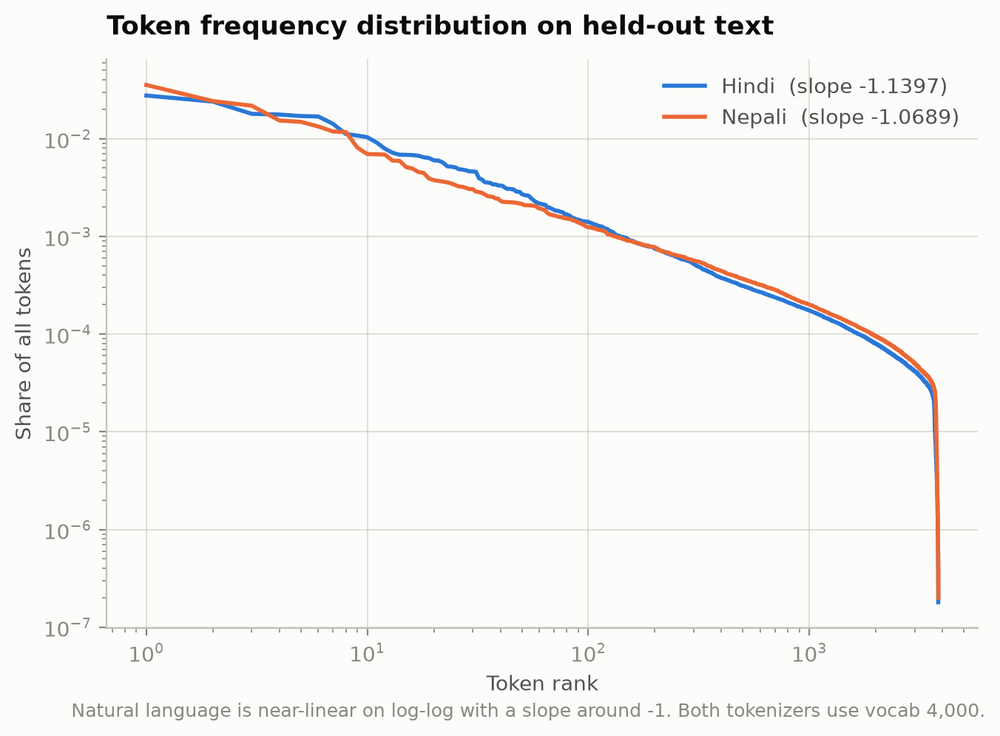

# Phase 1 — Tokenizer Report

| | |
|---|---|
| Generated (UTC) | 2026-08-25 09:38:50 |
| Git commit | `987ad30458abfbc6b83154a7717d846e4bc85abc` |
| Branch | `phase-1` |
| Working tree | **dirty** — uncommitted changes present |

> Values marked **ESTIMATE** are character-based proxies computed before a tokenizer existed. Final token counts are measured by encoding the final corpus with the final tokenizer (`count_corpus_tokens.py`).

## Algorithm and configuration

SentencePiece, trained **from scratch** on the training split only. No pretrained tokenizer or model is used anywhere in this project.

Key settings (full config in `<lang>/configs/tokenizer_config.yaml`):

| Setting | Value | Why |
|---|---|---|
| `model_type` | `unigram` | Kudo (2018); probabilistic segmentation |
| `byte_fallback` | `true` | Makes UNK structurally zero — unseen characters decompose to UTF-8 byte pieces |
| `normalization_rule_name` | `identity` | Normalisation happens once, in `build_corpus.normalize()`. Two normalisers in sequence means stored text and tokenizer-visible text diverge |
| `split_digits` | `true` | Stops numerals consuming merge budget |
| `character_coverage` | `0.9999` | Devanagari plus incidental Latin |

### Why byte-fallback rate replaces UNK rate

With `byte_fallback=True` the UNK rate is structurally zero, so it cannot discriminate between candidate vocabularies. The successor metric is the **byte-fallback rate**: the fraction of emitted tokens that are raw `<0xNN>` pieces. On Devanagari this is the quantity that tracks token inflation — stranded single bytes are what make English-centric tokenizers expensive on Indic scripts.


_Fertility against embedding cost across the vocabulary sweep_



_Token frequency against rank on held-out text, log-log_

## Hindi

### Vocabulary sweep

| Vocab | Algorithm | Fertility | Δ vs prev | chars/token | byte-fallback | Embedding share | Selected |
|--:|---|--:|--:|--:|--:|--:|:-:|
| 4,000 | unigram | 1.6553 | — | 3.1281 | 7.36e-03 | 8.2% | **yes** |
| 8,000 | unigram | 1.4748 | 10.90% | 3.5109 | 8.26e-03 | 16.4% |  |
| 16,000 | unigram | 1.3609 | 7.72% | 3.8047 | 8.95e-03 | 32.8% |  |
| 32,000 | unigram | 1.2894 | 5.25% | 4.0156 | 9.45e-03 | 65.5% | **yes** |

### Selected: **4,000**

OVERRIDE. The elbow criterion selected 32,000; 4,000 shipped instead. the elbow criterion optimises fertility alone and never stops while fertility keeps improving; at 32000 the embedding matrix is 16.4M of a 25M parameter budget (66%), leaving 8.6M for the transformer. 4000 sits at 1.21x the Tao et al. (2024) scaling-law optimum of 3311 for 15M non-vocab params at d_model=512, spends 8.2% of the budget on embeddings, and has the lowest byte-fallback rate in the sweep. The complete sweep is retained in sweep_results.csv so the trade-off stays inspectable. Original elbow reasoning: largest feasible size (32000); no elbow found within the swept range, so the sweep should be extended upward before treating this as optimal

Scaling-law reference (Tao et al. 2024, N_v ∝ N_nv^0.83): **3,311** — selected size is 9.6648× that.

Selection is an elbow on marginal fertility gain, not minimum fertility. Fertility falls monotonically with vocabulary size, so 'lowest fertility' would always return the largest size swept and the sweep would be decorative.

### Measurements on the held-out test split

| Metric | Value |
|---|--:|
| Fertility (tokens/word) | 1.6522 |
| Characters per token | 3.1276 |
| Bytes per token | 7.9557 |
| UNK rate | 0.00e+00 |
| Byte-fallback rate | 7.32e-03 |
| Vocabulary utilisation | 95.8% |
| Pieces never used | 170 |

#### Fertility by provenance

| Provenance | Fertility |
|---|--:|
| manual | 1.6682 |
| downloaded | 1.6479 |

_If manual fertility is materially worse than downloaded, the tokenizer is under-serving the data collected by hand._

### Training corpus size

- Training tokens: **559,913,515** (MEASURED)
- Measured chars/token: **3.125** — by provenance: {'manual': 3.101, 'downloaded': 3.132}

### Example tokenizations

# Tokenization examples — hindi

Produced by `tokenizer_report.py` from the final tokenizer. `▁` marks a word boundary (SentencePiece's space marker); `<0xNN>` pieces are byte fallbacks.

### Example 1

**Input** (44 chars, 11 words):

```
भारत सरकार ने आज एक नई योजना की घोषणा की है।
```

**Tokens** (12 pieces, fertility 1.09):

```
▁भारत | ▁सरकार | ▁ने | ▁आज | ▁एक | ▁नई | ▁योजना | ▁की | ▁घोषणा | ▁की | ▁है | ।
```

**IDs:** `[412, 435, 274, 479, 288, 826, 893, 266, 1671, 266, 264, 260]`

**Round-trip exact:** yes

---

### Example 2

**Input** (65 chars, 13 words):

```
उन्होंने बताया कि पहले चरण में दस लाख किसानों को इसका लाभ मिलेगा।
```

**Tokens** (14 pieces, fertility 1.08):

```
▁उन्होंने | ▁बताया | ▁कि | ▁पहले | ▁चरण | ▁में | ▁दस | ▁लाख | ▁किसानों | ▁को | ▁इसका | ▁लाभ | ▁मिलेगा | ।
```

**IDs:** `[372, 461, 279, 390, 1747, 263, 2137, 706, 1510, 268, 707, 1159, 2196, 260]`

**Round-trip exact:** yes

---

### Example 3

**Input** (49 chars, 7 words):

```
अंतरराष्ट्रीय व्यापार समझौते पर हस्ताक्षर किए गए।
```

**Tokens** (8 pieces, fertility 1.14):

```
▁अंतरराष्ट्रीय | ▁व्यापार | ▁समझौते | ▁पर | ▁हस्ताक्षर | ▁किए | ▁गए | ।
```

**IDs:** `[2617, 1462, 3812, 273, 3914, 634, 406, 260]`

**Round-trip exact:** yes

---

### Example 4

**Input** (61 chars, 9 words):

```
कोविड-19 महामारी के दौरान 2020 में अर्थव्यवस्था प्रभावित हुई।
```

**Tokens** (17 pieces, fertility 1.89):

```
▁कोविड | - | 1 | 9 | ▁महामारी | ▁के | ▁दौरान | ▁ | 2 | 0 | 2 | 0 | ▁में | ▁अर्थव्यवस्था | ▁प्रभावित | ▁हुई | ।
```

**IDs:** `[2575, 282, 287, 330, 3191, 261, 497, 262, 286, 283, 286, 283, 263, 3349, 1628, 422, 260]`

**Round-trip exact:** yes

---

### Example 5

**Input** (51 chars, 9 words):

```
यह एक बहुत लंबा और जटिल शब्द है: उत्तरदायित्वपूर्ण।
```

**Tokens** (18 pieces, fertility 2.00):

```
▁यह | ▁एक | ▁बहुत | ▁लंबा | ▁और | ▁ज | ट | िल | ▁शब्द | ▁है | : | ▁उत्तर | दा | य | ि | त्व | पूर्ण | ।
```

**IDs:** `[306, 288, 484, 3363, 269, 421, 300, 693, 1271, 264, 388, 633, 472, 331, 325, 1041, 1237, 260]`

**Round-trip exact:** yes

---

### Example 6

**Input** (45 chars, 11 words):

```
मैंने कहा था कि वह नहीं आएगा, लेकिन वह आ गया।
```

**Tokens** (14 pieces, fertility 1.27):

```
▁मैंने | ▁कहा | ▁था | ▁कि | ▁वह | ▁नहीं | ▁आए | गा | , | ▁लेकिन | ▁वह | ▁आ | ▁गया | ।
```

**IDs:** `[1429, 326, 304, 279, 345, 294, 818, 493, 265, 394, 345, 317, 307, 260]`

**Round-trip exact:** yes

---


## Nepali

### Vocabulary sweep

| Vocab | Algorithm | Fertility | Δ vs prev | chars/token | byte-fallback | Embedding share | Selected |
|--:|---|--:|--:|--:|--:|--:|:-:|
| 4,000 | unigram | 1.8387 | — | 3.6452 | 2.16e-03 | 8.2% | **yes** |

### Selected: **4,000**

OVERRIDE. The elbow criterion selected 4,000; 4,000 shipped instead. see sweep_results_selection.csv for the four-point sweep this choice was made from. The complete sweep is retained in sweep_results.csv so the trade-off stays inspectable. Original elbow reasoning: largest feasible size (4000); no elbow found within the swept range, so the sweep should be extended upward before treating this as optimal

Scaling-law reference (Tao et al. 2024, N_v ∝ N_nv^0.83): **3,311** — selected size is 1.2081× that.

Selection is an elbow on marginal fertility gain, not minimum fertility. Fertility falls monotonically with vocabulary size, so 'lowest fertility' would always return the largest size swept and the sweep would be decorative.

### Measurements on the held-out test split

| Metric | Value |
|---|--:|
| Fertility (tokens/word) | 1.8457 |
| Characters per token | 3.6261 |
| Bytes per token | 9.715 |
| UNK rate | 0.00e+00 |
| Byte-fallback rate | 2.39e-03 |
| Vocabulary utilisation | 96.0% |
| Pieces never used | 161 |

#### Fertility by provenance

| Provenance | Fertility |
|---|--:|
| manual | 1.8072 |
| downloaded | 1.8558 |

_If manual fertility is materially worse than downloaded, the tokenizer is under-serving the data collected by hand._

### Training corpus size

- Training tokens: **35,314,141** (MEASURED)
- Measured chars/token: **3.671** — by provenance: {'manual': 3.671}

### Example tokenizations

# Tokenization examples — nepali

Produced by `tokenizer_report.py` from the final tokenizer. `▁` marks a word boundary (SentencePiece's space marker); `<0xNN>` pieces are byte fallbacks.

### Example 1

**Input** (51 chars, 9 words):

```
नेपाल सरकारले आज एक नयाँ कार्यक्रमको घोषणा गरेको छ।
```

**Tokens** (11 pieces, fertility 1.22):

```
▁नेपाल | ▁सरकारले | ▁आज | ▁एक | ▁नयाँ | ▁कार्यक्रम | को | ▁घोषणा | ▁गरेको | ▁छ | ।
```

**IDs:** `[317, 440, 477, 290, 473, 487, 261, 879, 284, 266, 260]`

**Round-trip exact:** yes

---

### Example 2

**Input** (59 chars, 10 words):

```
उहाँले पहिलो चरणमा दश लाख किसानले यसको लाभ पाउने बताउनुभयो।
```

**Tokens** (12 pieces, fertility 1.20):

```
▁उहाँले | ▁पहिलो | ▁चरणमा | ▁दश | ▁लाख | ▁किसान | ले | ▁यसको | ▁लाभ | ▁पाउने | ▁बताउनुभयो | ।
```

**IDs:** `[1174, 511, 1992, 1986, 367, 1272, 263, 848, 2194, 1065, 1356, 260]`

**Round-trip exact:** yes

---

### Example 3

**Input** (50 chars, 5 words):

```
अन्तर्राष्ट्रिय व्यापार सम्झौतामा हस्ताक्षर गरियो।
```

**Tokens** (7 pieces, fertility 1.40):

```
▁अन्तर्राष्ट्रिय | ▁व्यापार | ▁सम्झौता | मा | ▁हस्ताक्षर | ▁गरियो | ।
```

**IDs:** `[1072, 950, 940, 262, 2384, 2704, 260]`

**Round-trip exact:** yes

---

### Example 4

**Input** (59 chars, 8 words):

```
कोभिड-१९ महामारीका बेला २०७७ सालमा अर्थतन्त्र प्रभावित भयो।
```

**Tokens** (12 pieces, fertility 1.50):

```
▁कोभिड | - | १९ | ▁महामारी | का | ▁बेला | ▁२०७७ | ▁सालमा | ▁अर्थतन्त्र | ▁प्रभावित | ▁भयो | ।
```

**IDs:** `[1411, 301, 1385, 1638, 265, 760, 3174, 2296, 1929, 1632, 597, 260]`

**Round-trip exact:** yes

---

### Example 5

**Input** (47 chars, 8 words):

```
यो निकै लामो र जटिल शब्द हो: उत्तरदायित्वपूर्ण।
```

**Tokens** (15 pieces, fertility 1.88):

```
▁यो | ▁निकै | ▁लामो | ▁र | ▁जटिल | ▁शब्द | ▁हो | : | ▁उत्तर | दा | य | ित | ्व | पूर्ण | ।
```

**IDs:** `[300, 1083, 1013, 267, 3245, 1980, 282, 2184, 1410, 588, 320, 341, 897, 1436, 260]`

**Round-trip exact:** yes

---

### Example 6

**Input** (51 chars, 9 words):

```
मैले भनेको थिएँ कि उहाँ आउनुहुन्न, तर उहाँ आउनुभयो।
```

**Tokens** (17 pieces, fertility 1.89):

```
▁मैले | ▁भने | को | ▁थिए | ँ | ▁कि | ▁उहाँ | ▁आउन | ु | हु | न्न | , | ▁तर | ▁उहाँ | ▁आउन | ुभयो | ।
```

**IDs:** `[1184, 289, 261, 325, 306, 403, 1079, 1094, 286, 1005, 1091, 264, 335, 1079, 1094, 2064, 260]`

**Round-trip exact:** yes

---

